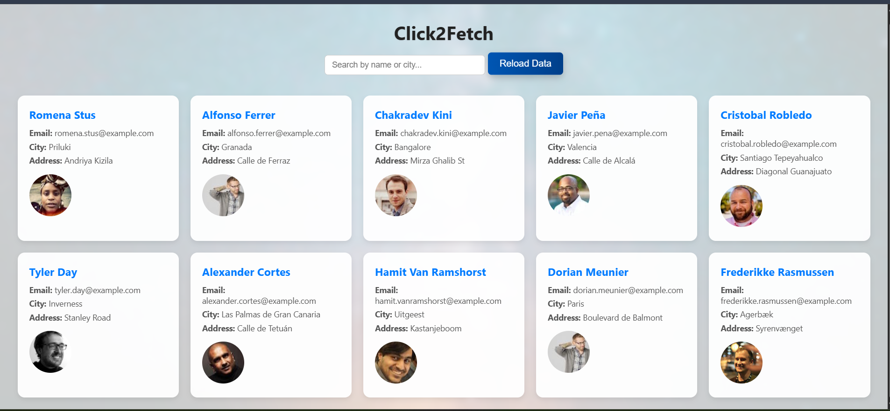
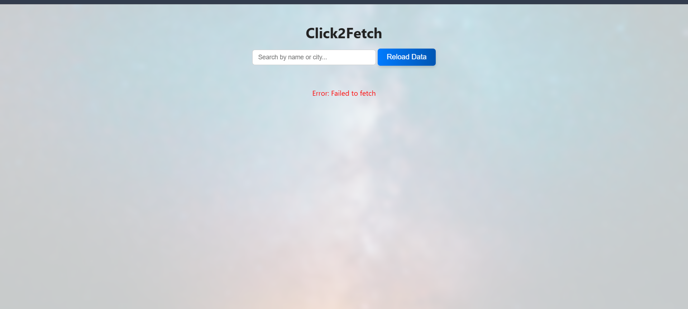

# CLICK2FETCH

A simple web app that fetches and displays random users using the Random User API.  
Users can reload the page to see new profiles, and a search feature allows quick filtering.

## 🚀 Features
- Fetch random users on button click
- Show name, email, address, and profile picture
- Search by name or city
- Loading indicator while fetching data
- Error handling for network issues

## 📸 Screenshots

### Internet not disabled

### Internet disabled

## 🛠 Tech Stack
- HTML
- CSS
- JavaScript
- Random User API

